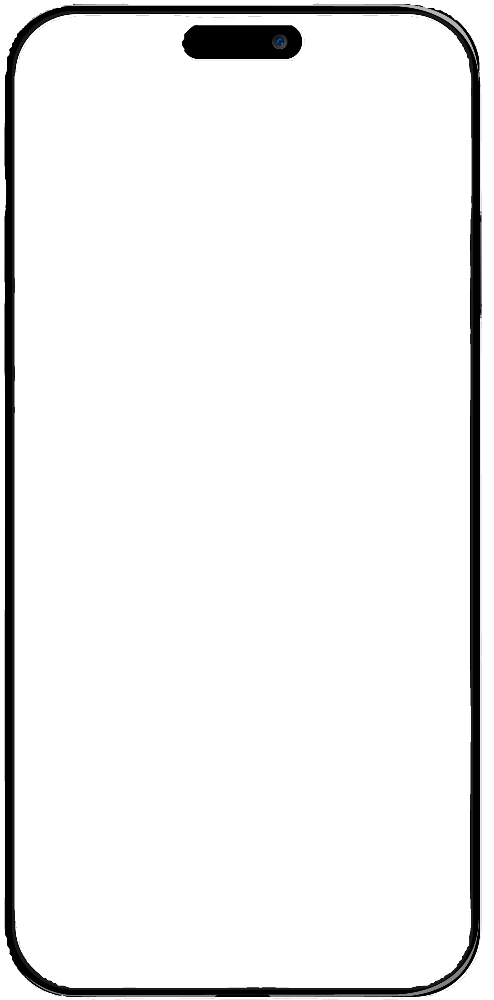

# Estadísticas de Influencers: TikTok, Instagram y Vista de Celular

Archivo base: `servicios_gisea/influencers.html`  
Estilos: `css/servicios/influencers.css`  
JS funcional:  
- `influncer_portafolio/js/counter-animation.js`
- `influncer_portafolio/js/social-embeds.js`
- `influncer_portafolio/js/plyr-config.js`

## Resumen
La página de Influencers incluye:
- Una sección de “Estadísticas” con dos cards (TikTok e Instagram) que muestran un contador animado y el embed oficial con fallback de carga.
- Una “vista de celular” para mostrar videos con un marco de iPhone y un reproductor de video controlado por la librería Plyr.

---

## Estructura de la sección de estadísticas

Ubicación: `servicios_gisea/influencers.html` (sección `<section class="stats-section py-5">`).

Cada card sigue esta estructura general:
tik tok card

```html
<div class="col-md-6 col-lg-4" data-aos="fade-up" data-aos-delay="0">
  <div class="stats-card p-4 h-100">
    <div class="mb-3">
      <!-- Icono + @usuario -->
    </div>

    <h3 class="fw-bold display-6">
      <span id="count-tiktok">0</span><span class="text-pink">k</span>
    </h3>
    <p class="subtitle text-pink mb-3">Tiktok Followers</p>
    <p class="desc small">Descripción breve</p>

    <!-- Placeholder + embed -->
    <div class="tiktok-wrapper">
      <div class="tiktok-placeholder">
        <div class="tiktok-loading">
          <i class="bi bi-tiktok fs-1 text-dark mb-2"></i>
          <p class="small text-muted">Cargando contenido...</p>
        </div>
      </div>
      <blockquote class="tiktok-embed" cite="https://www.tiktok.com/@usuario"
        data-unique-id="usuario" data-embed-type="creator" style="display: none;">
        <section>
          <a target="_blank" href="https://www.tiktok.com/@usuario?refer=creator_embed">@usuario</a>
        </section>
      </blockquote>
    </div>

    <a href="https://www.tiktok.com/@usuario" target="_blank" class="btn btn-follow mt-3">Sígueme</a>
  </div>
</div>
```
Ejemplo de card Instagram (estructura del embed):


<div class="instagram-wrapper">
  <div class="instagram-placeholder">
    <div class="instagram-loading">
      <i class="bi bi-instagram fs-1 text-danger mb-2"></i>
      <p class="small text-muted">Cargando contenido...</p>
    </div>
  </div>
  <blockquote class="instagram-media"
    data-instgrm-permalink="https://www.instagram.com/usuario/"
    data-instgrm-version="14" style="display: none;">
    <!-- Estructura del embed oficial -->
  </blockquote>
</div>

Scripts oficiales requeridos (al final de la página):

<script async src="https://www.tiktok.com/embed.js"></script>
<script async src="//www.instagram.com/embed.js"></script>

## Contadores de seguidores (animación)
---
Archivo: `influncer_portafolio/js/counter-animation.js`

- Usa IntersectionObserver para iniciar la animación cuando .stats-section entra al viewport.
- IDs esperados en el HTML: count-tiktok, count-instagram.

- Valores configurables en el arreglo socialStats:

```javascript
const socialStats = [
  { id: "count-tiktok", value: 696 },
  { id: "count-instagram", value: 42 },
];
```

- El sufijo “k” se muestra en el HTML (no lo agrega el JS).

Cómo actualizar:

- Cambia los valores en socialStats con los números reales.
- Mantén <span class="text-pink">k</span> en el HTML si deseas la abreviatura en miles.

---
## Embeds sociales con placeholder y fallback

Archivo: `influncer_portafolio/js/social-embeds.js`

- Muestra un placeholder mientras se carga el embed.
- Revisa periódicamente si el embed tiene altura > 0; al detectar carga, oculta el placeholder y muestra el embed.
- Incluye un timeout de respaldo (~3s) para evitar placeholders eternos si los scripts oficiales tardan.

Estructura esperada:

- TikTok: .tiktok-wrapper contiene .tiktok-placeholder + blockquote.tiktok-embed.
- Instagram: .instagram-wrapper contiene .instagram-placeholder + blockquote instagram-media.

---
## Vista de Celular (marco + video)
```html
<div class="phone-frame">
  
  <div class="video-container">
    <video class="plyr-video" muted>
      <source src="../influncer_portafolio/media/video.mp4" type="video/mp4">
    </video>
  </div>
</div>
```

Composición:
- phone-image: PNG del marco (por encima, z-index: 2).
- video-container: detrás del marco, con border-radius y overflow: hidden para que el video “encaje” en la pantalla.
- El video tiene clase .plyr-video para que Plyr lo inicialice automáticamente.

CSS clave: `css/servicios/influencers.css`

- .phone-frame, .phone-image, .video-container
- Media queries para tablet y móvil ajustan top, left, width, height del contenedor del video.

---

## Reproductor de video: Plyr

<link rel="stylesheet" href="https://cdn.plyr.io/3.7.8/plyr.css">
<script src="https://cdn.plyr.io/3.7.8/plyr.polyfilled.js"></script>

Inicialización y configuración:
- Archivo: influncer_portafolio/js/plyr-config.js
- Selector: .plyr-video
- Controles: play-large, play, progress, mute, volume

- Opciones:

- clickToPlay: true
- hideControls: true
- muted: true
- volume: 0.8
- fullscreen.enabled: false (para mantener la ilusión del marco)

Personalización visual en`css/servicios/influencers.css` 
- (.plyr, .plyr__controls, .plyr__control--overlaid, progreso, etc.).
